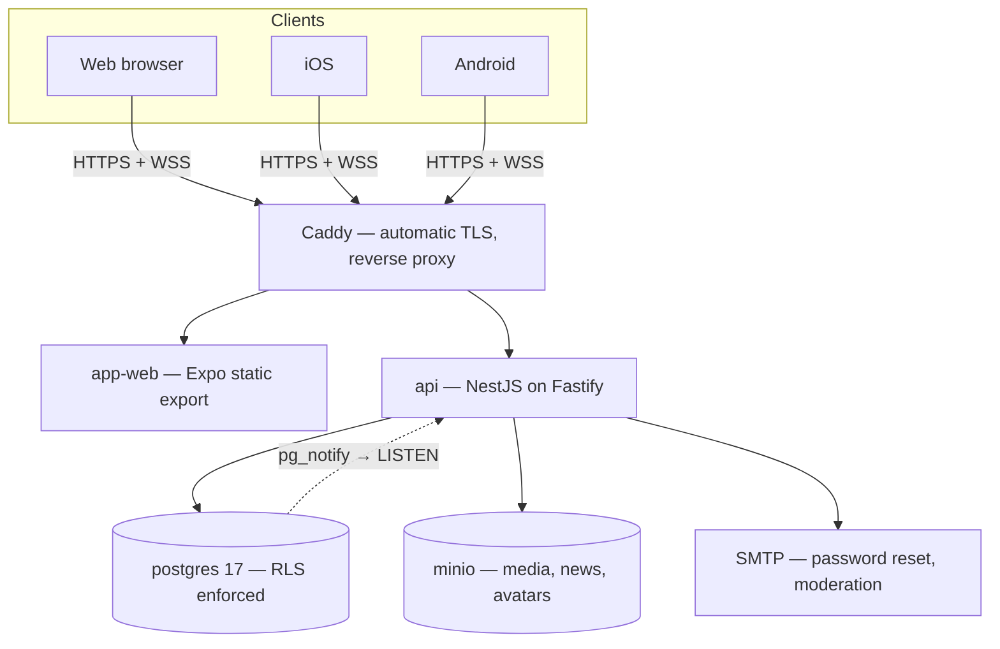
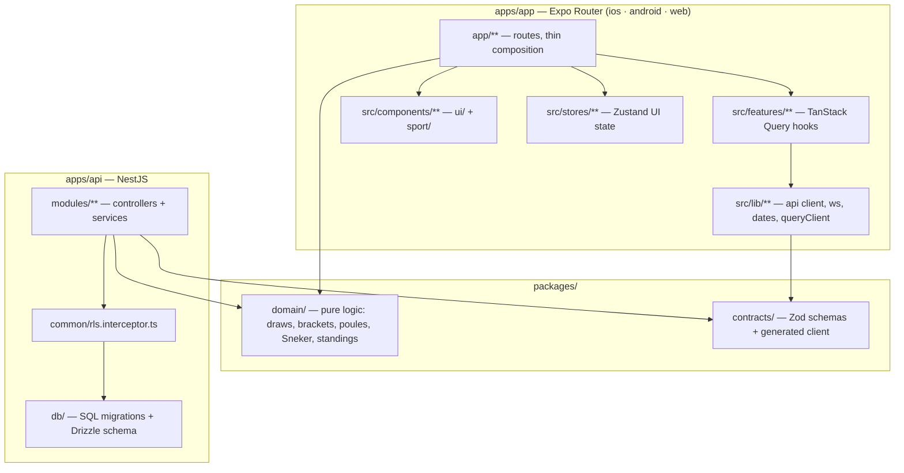

# Architecture — KV Eendracht v2

> Current architecture. For the Supabase-based v1 this replaces, see
> [[ARCHITECTURE-v1-supabase]]. The functional specification in
> [[KV-EENDRACHT-APP-SPEC]] remains authoritative for *what* the app does — this note covers
> *how* it is now built and run.

## System overview



All five services are containers described by one `docker-compose.yml`, with a production
overlay adding Caddy and swapping development conveniences for real ones. Hosting is
deliberately unpinned — see [[INFRA]].

## Layers



`packages/domain` is imported by **both** applications. That is the structural fix for the
rule in [[KV-EENDRACHT-APP-SPEC#10. Domain rules — draws, scoring, standings]] that the
client-side standings module and the database RPC must change together — see
[[ADR-0004-pnpm-monorepo]].

## The three decisions that explain most of the code

**1. Draws run client-side, standings run server-side.** Unchanged from v1, and still right. A
draw is interactive — preview, re-draw, manual moves, confirm — so it lives in the app as pure
seeded functions, and the seed is stored so any published draw is reproducible. Standings and
attendance are bookkeeping, so Postgres owns them through `SECURITY DEFINER` RPCs and a full
recalculation is always possible. See [[Telling-en-standen]] and [[Lotingsvormen]].

**2. RLS is still the only authorization layer.** The API is deliberately *subject to* the
policies rather than privileged above them, connecting as a role that is neither superuser nor
`BYPASSRLS`. Every request runs in a transaction that sets the JWT claims, so all 43
`auth.uid()` call sites keep working. The full reasoning, including the pooling trap, is in
[[ADR-0003-keep-rls-as-the-authorization-layer]].

**3. Result writes are idempotent.** `match_results.client_mutation_id` is `UNIQUE`. The score
entry screen generates one UUID per entry session and reuses it on retry, so a dropped
connection at the side of the pitch can never produce a duplicate result. This survives the
backend change untouched — it was always a database constraint.

## Caching, offline and realtime

Carried over from v1 in full; only the transport changed.

- `PersistQueryClientProvider` with a 24-hour `maxAge`, so agenda, news, standings and
  tournaments stay readable offline with a "last updated" timestamp.
- `staleTime` per domain in `src/lib/queryClient.ts`: agenda and news 5 min, standings 60 s,
  tournaments 2 min, live matches 10 s, community 60 s.
- Mutations use `networkMode: 'online'` so nothing is silently lost; score entry autosaves a
  local draft under `uitslag-concept-<matchId>`.
- Optimistic updates are permitted **only** for likes and votes. Never for results.
- Live updates arrive over WebSocket and carry only a table name and id; the client
  invalidates the matching query key and refetches through the authorized path. See
  [[ADR-0005-websocket-for-realtime]].

## Platform shell

One Expo Router codebase serves phones and desktops, per
[[ADR-0002-react-native-on-all-platforms]]. A `useBreakpoint` hook drives the difference:
bottom tab bar and single-column below the tablet breakpoint, sidebar navigation and denser
multi-column layouts above it. The admin screens benefit most — the tournament builder in
[[SCREENS]] becomes genuinely usable when participant selection and draw preview sit
side by side.

## Quality gates

Run after every change, from the repository root:

```bash
pnpm typecheck && pnpm lint && pnpm test && pnpm --filter domain verify
```

`pnpm --filter domain verify` runs the 17 dependency-free domain checks, including the
N = 2…100 partition sweep. It must stay at 17/17 — it is the regression guard proving the draw
and standings maths is unchanged.

## Related

- [[API]] — endpoint surface, auth flow, error contract
- [[INFRA]] — containers, environments, backups
- [[DATABASE]] — schema, RPCs, RLS matrix
- [[SCREENS]] — routes and user flows
- [[Kaatsen-glossarium]] — what partuur, eersten and omloop mean
