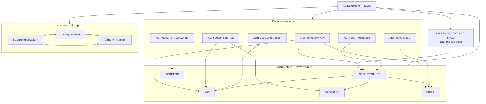

# KV Eendracht — Map of Content

> **Start here.** This is the hub note for the KV Eendracht app: a cross-platform application
> for a Frisian handball (*kaatsen*) club, running on containerized infrastructure.
>
> Everything below links to a note. Open the **graph view** (⌘G) to see how they relate — that
> is what this vault is for.

## How the notes relate

## The specification

[[KV-EENDRACHT-APP-SPEC]] — the single source of truth for **what** the app does: roles,
screens, data model, RLS matrix, domain rules, feature inventory. Headings are stable anchors,
so deep links work: [[KV-EENDRACHT-APP-SPEC#7. Data model]],
[[KV-EENDRACHT-APP-SPEC#9. Row Level Security matrix]],
[[KV-EENDRACHT-APP-SPEC#10. Domain rules — draws, scoring, standings]].

## Architecture — how it is built

| Note | Covers |
|---|---|
| [[ARCHITECTURE]] | Current system overview, layers, caching, quality gates |
| [[API]] | Endpoint surface, auth and token strategy, error contract |
| [[DATABASE]] | 30 tables, views, RPCs, RLS matrix |
| [[SCREENS]] | Routes and user flows |
| [[INFRA]] | Containers, database roles, configuration, backups |
| [[ARCHITECTURE-v1-supabase]] | Superseded — the Supabase design, kept for context |

## Decisions — why it is built that way

| ADR | Decision |
|---|---|
| [[ADR-0001-own-api-instead-of-supabase]] | Own API on plain Postgres, not Supabase |
| [[ADR-0002-react-native-on-all-platforms]] | One React Native codebase → iOS, Android, web |
| [[ADR-0003-keep-rls-as-the-authorization-layer]] | Postgres RLS stays the only authorization layer |
| [[ADR-0004-pnpm-monorepo]] | pnpm monorepo with a shared domain package |
| [[ADR-0005-websocket-for-realtime]] | `pg_notify` over WebSocket for live updates |
| [[ADR-0006-minio-for-object-storage]] | MinIO for photos and media |

## The sport

Reading these first makes the rest of the codebase legible — the domain vocabulary is Frisian
and stays untranslated on purpose.

| Note | Covers |
|---|---|
| [[Kaatsen-glossarium]] | Partuur, eersten, omloop, opslag, perk, staand nummer |
| [[Lotingsvormen]] | The six draw formats and the partition maths |
| [[Telling-en-standen]] | Match scoring, KNKB poules, Sneker telling, standings, attendance |

## Plan and rules

| Note | Covers |
|---|---|
| [[PROJECT_PLAN]] | Phases and progress for the Dockerized rebuild |
| [[CLAUDE]] | Project rules — read before editing anything |
| [[PROJECT_PLAN-v1]] | Superseded — v1 phase log, kept for context |

## Where things stand

v1 was a complete Expo + Supabase Cloud application: 24 screens, ~7.000 lines of TypeScript,
30 tables with RLS throughout, and a tested pure-domain layer. It works.

v2 keeps the design and changes the foundation. The infrastructure becomes containerized, the
backend becomes ours, and the same React Native codebase gains a web target so the club has a
public site and admins get a desktop surface for tournament draws. The pure domain logic and
almost all of the SQL carry over rather than being rewritten — the reasoning, and the
measurements behind it, are in [[ADR-0001-own-api-instead-of-supabase]].

Current phase and open work: [[PROJECT_PLAN]].

---

*This vault is generated from the repository's `docs/` directory. The repository is the source
of truth; run `pnpm docs:sync` after editing there. Editing notes directly in Obsidian is fine
for thinking, but changes will be overwritten on the next sync — move anything worth keeping
back into `docs/`.*
