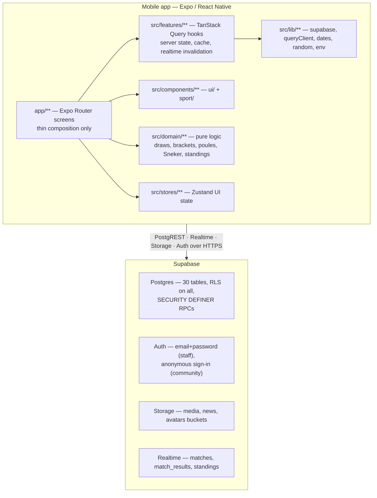
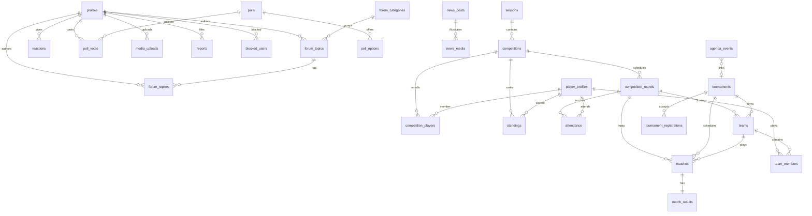

# KV Eendracht App — Complete Specification

> **Purpose of this file.** Single source of truth describing everything the app does,
> where every behaviour lives in the codebase, how the data model and permissions work,
> and the exact sport rules encoded in the domain layer.
>
> **For Claude Code:** read this file first in any new session on this repo. It is a map,
> not a substitute for the code — file paths are authoritative; when this doc and the code
> disagree, the code wins and this doc should be updated in the same commit.
>
> **For Obsidian:** headings are stable anchors; link to sections as
> `[[KV-EENDRACHT-APP-SPEC#7. Data model]]`. Mermaid blocks render natively.

---

## Table of contents

1. [Project at a glance](#1-project-at-a-glance)
2. [Tech stack and versions](#2-tech-stack-and-versions)
3. [Architecture](#3-architecture)
4. [Repository map — which file does what](#4-repository-map--which-file-does-what)
5. [Roles and permissions](#5-roles-and-permissions)
6. [Screen map and user flows](#6-screen-map-and-user-flows)
7. [Data model](#7-data-model)
8. [Views, RPCs, triggers](#8-views-rpcs-triggers)
9. [Row Level Security matrix](#9-row-level-security-matrix)
10. [Domain rules — draws, scoring, standings](#10-domain-rules--draws-scoring-standings)
11. [Feature inventory and status](#11-feature-inventory-and-status)
12. [Conventions and guardrails](#12-conventions-and-guardrails)
13. [Testing](#13-testing)
14. [Setup and operations](#14-setup-and-operations)
15. [Known limitations, drift and roadmap](#15-known-limitations-drift-and-roadmap)
16. [Glossary of Frisian handball (kaatsen) terms](#16-glossary-of-frisian-handball-kaatsen-terms)
17. [Change recipes — "I want to change X"](#17-change-recipes--i-want-to-change-x)

---

## 1. Project at a glance

Cross-platform mobile app for **Kaatsvereniging KV Eendracht**, a Frisian handball
(*kaatsen*) club. Target: publication in Apple App Store and Google Play Store.

| Property | Value |
|---|---|
| App name | KV Eendracht |
| iOS bundle id | `nl.kveendracht.app` |
| Android package | `nl.kveendracht.app` |
| Deep link scheme | `kveendracht://` |
| UI language | Dutch, locale `nl-NL` |
| Timezone | `Europe/Amsterdam`, 24-hour clock |
| Backend | Supabase (Postgres + Auth + Storage + Realtime) |
| Distribution | EAS Build / EAS Submit |

**Product priorities**, in order (these drive every trade-off):

1. Reliable match and draw logic
2. Correct competition standings
3. Automatic attendance registration
4. Safe admin permissions (enforced by RLS, never by hidden UI)
5. One-handed operation at the side of the pitch
6. Modern American-sportscast visual identity
7. Maintainable code

**Visual identity.** ESPN-inspired but original: large condensed italic sport headings
(Barlow Condensed), body text in Inter, tabular numerals for every score, dark surfaces for
sport content, skewed accent bars (−8°), status chips `LIVE` / `BINNENKORT` / `AFGELOPEN`,
club red `#B3121F` with ochre/gold `#E8A926` accents.

---

## 2. Tech stack and versions

| Concern | Choice | Notes |
|---|---|---|
| Runtime | Expo SDK 54, React Native 0.81, React 19.1 | `newArchEnabled: true` |
| Routing | Expo Router 6 (file-based, typed routes) | `app/` directory |
| Language | TypeScript **strict** | `noImplicitReturns`, `noFallthroughCasesInSwitch` |
| Server state | TanStack Query 5 + AsyncStorage persister | 24 h offline cache |
| Local UI state | Zustand 5 | **only** UI state, never server data |
| Forms | React Hook Form + Zod resolver | Dutch validation messages |
| Validation | Zod 3 | also used for env validation |
| Backend | `@supabase/supabase-js` 2 | anon/publishable key only |
| Session storage | `expo-secure-store` (chunked adapter) | tokens exceed the 2 KB per-key limit |
| Images | `expo-image`, `expo-image-picker`, `expo-image-manipulator` | compression strips EXIF |
| Animation | `react-native-reanimated` 4 (+ `react-native-worklets`) | worklets is a required peer install |
| Testing | Jest (`jest-expo`) + React Native Testing Library | plus dependency-free verify script |
| Fonts | `@expo-google-fonts/barlow-condensed`, `.../inter` | loaded in root layout |

**Version drift policy:** run `npx expo install --fix` after any dependency change. Never
introduce a third-party package where Expo or React Native ships an equivalent.

---

## 3. Architecture



### Three architectural decisions that explain most of the code

**1. Draws run client-side, standings run server-side.**
A draw is an interactive process (preview, re-draw, manual moves, confirm) so it lives in the
app as pure functions with a stored seed, making every published draw reproducible. Standings
and attendance are bookkeeping: Postgres owns them via `SECURITY DEFINER` RPCs, so no client
can ever write an inconsistent table and a full recalculation is always possible.

**2. RLS is the only authorisation layer.**
The app ships only the anon/publishable key. Every query passes through policies. Roles live
in `profiles.role` and are read through `SECURITY DEFINER` helpers (`is_admin()`,
`is_moderator()`, `can_enter_results()`) to avoid recursive policy evaluation. The admin route
guard in `app/admin/_layout.tsx` is navigation comfort only — never security.

**3. Result writes are idempotent.**
`match_results.client_mutation_id` is `UNIQUE`. The entry screen generates one UUID per entry
session and reuses it on retry, so a dropped connection can never produce a duplicate result.

### Caching, offline and realtime

- `PersistQueryClientProvider` + AsyncStorage persister, `maxAge` 24 h — agenda, news,
  standings and tournaments stay readable offline with a "last updated" timestamp.
- `onlineManager` bound to NetInfo drives the `OfflineBanner`.
- `staleTime` per domain in `src/lib/queryClient.ts`: `STALE.agenda` 5 min, `STALE.news` 5 min,
  `STALE.standings` 60 s, `STALE.tournaments` 2 min, `STALE.liveMatches` 10 s, `STALE.community` 60 s.
- Mutations use `networkMode: 'online'` so nothing is silently lost; score entry additionally
  autosaves a local draft in AsyncStorage under `uitslag-concept-<matchId>`.
- Optimistic updates are allowed **only** for likes and votes. Never for results.
- Realtime channels: tournament detail subscribes to `matches` + `match_results`; the
  competition screen subscribes to `standings`.

---

## 4. Repository map — which file does what

```
kv-eendracht/
├── CLAUDE.md                    Project rules — read before editing anything
├── PROJECT_PLAN.md              Phase-by-phase progress + decision log
├── README.md                    Setup, testing, Expo Go, dev builds, EAS, stores
├── .env.example                 EXPO_PUBLIC_SUPABASE_URL / _ANON_KEY only
├── app.json                     Expo config: name, ids, scheme, plugins, locale
├── eas.json                     Build profiles: development / preview / production
├── eslint.config.js             Flat config + purity rules for src/domain
├── babel.config.js              babel-preset-expo
├── tsconfig.json                strict; path alias @/* → ./src/*
├── app/                         ROUTES (see §6)
├── src/
│   ├── domain/                  PURE LOGIC — no React, no Supabase imports
│   ├── features/                Query hooks per feature
│   ├── components/              ui/ (generic) + sport/ (score cards, tables)
│   ├── lib/                     supabase, queryClient, dates, random, env
│   ├── stores/                  Zustand
│   └── theme/                   tokens.ts, typography.ts
├── supabase/
│   ├── migrations/              3 SQL migrations (schema → functions → rls)
│   ├── seed.sql                 Fictional demo data
│   └── config.toml              Local CLI config
├── scripts/verify-domain.ts     Dependency-free domain verification (17 checks)
├── assets/images/               Logo + icons (currently placeholders)
└── docs/                        ARCHITECTURE.md, DATABASE.md, SCREENS.md
```

### `src/domain/**` — pure, seedable, unit-tested

| File | Responsibility |
|---|---|
| `loting/types.ts` | `DrawPlayer`, `DrawTeam`, `ReserveEntry`, `DrawResult` |
| `loting/partition.ts` | 2/3-player team partition maths (`computePartition`, `computePartitionWithSuggestion`) |
| `loting/del.ts` | Door Elkaar Loten draw |
| `loting/delAbc.ts` | D.E.L. ABC strict/flexible draw + `validateAbcTeam` |
| `loting/tweeTegenTwee.ts` | 2-vs-2 draw |
| `loting/pearke.ts` | Mixed pair (dame + heer) draw with motivated override |
| `loting/vrijeFormatie.ts` | Free-formation validation incl. "Beperkt" restrictions |
| `toernooi/knockout.ts` | Bracket generation, seeding, byes, `advanceWinner`, consolation, `roundLabel`, `findDoubleActivePlayers` |
| `toernooi/poule.ts` | Poule assignment, round-robin schedule, KNKB standings + tiebreaks |
| `toernooi/sneker.ts` | Sneker telling config, multi-round draws with repeat minimisation, individual ranking |
| `toernooi/matchResult.ts` | Zod result schema, `autoWinner`, `findPlayersInMultipleActiveMatches` |
| `competitie/standings.ts` | Sort rules, `computeSaldo`, `aggregateMatchLines` (mirror of the DB RPC) |
| `competitie/attendance.ts` | Attendance state machine mirror + finalize preview |
| `__tests__/` | Jest suites: `loting`, `toernooi`, `competitie`, `matchResult` + `testUtils.ts` |

### `src/features/**` — data access

| File | Exports (selection) |
|---|---|
| `auth/useAuth.ts` | `useAuthListener`, `useLogin`, `useForgotPassword`, `useAnonymousSignIn`, `useLogout`, `translateAuthError` |
| `public/queries.ts` | `useAgenda`, `useAgendaEvent`, `useNews`, `useNewsPost`, `useTournaments`, `useTournament`, `useCompetitions`, `useStandings`, `useActivePoll`, `usePollResults`, `useRecentResults` |
| `community/hooks.ts` | `useForumCategories`, `useForumTopics`, `useForumTopic`, `useCreateTopic`, `useCreateReply`, `useToggleLike`, `useVote`, `useMyVote`, `useApprovedPhotos`, `useUploadPhoto`, `useReport`, `useCommunityFeatures`, `translateDbError` |
| `admin/hooks.ts` | `usePlayersAdmin`, `useSavePlayer`, `useArchivePlayer`, `findPossibleDuplicates`, `useRounds`, `useRoundMatches`, `useApplyMatchResult`, `useFinalizePreview`, `useFinalizeRound`, `useReopenRound`, `useModerationQueue`, `useModerate`, `useAdminDashboard` |

### `src/components/**`

| File | Contents |
|---|---|
| `ui/index.tsx` | `StatusLabel`, `Card`, `SectionHeader`, `Button`, `Skeleton`, `CardSkeleton`, `EmptyState`, `ErrorState`, `OfflineBanner` |
| `sport/ScoreCard.tsx` | Dark score card: status chip, red/white sides, serve badge, large tabular score |
| `sport/StandingsTable.tsx` | Fixed-width standings table with position, rise/fall arrow, V/T/S/D/A columns |

### `src/lib/**`

| File | Contents |
|---|---|
| `supabase.ts` | Single client; chunked SecureStore adapter; AppState-driven token refresh |
| `queryClient.ts` | QueryClient defaults, AsyncStorage persister, `STALE` constants, NetInfo binding |
| `dates.ts` | All nl-NL/Amsterdam formatting: `formatDate`, `formatTime`, `formatDateTime`, `formatEventMoment`, `formatRelative`, `formatMonthYear`, `isSameDay` |
| `random.ts` | `createRng` (mulberry32), `newSeed`, `shuffle` (Fisher–Yates), `randomInt` |
| `env.ts` | Zod-validated `EXPO_PUBLIC_*` variables; warns in Dutch when missing |

---

## 5. Roles and permissions

Four roles stored in `profiles.role`: `guest` < `moderator` < `admin` < `super_admin`.
Plus a per-profile boolean `match_entry_rights` that grants result entry to a moderator.

| Actor | Auth | Can do |
|---|---|---|
| **Public visitor** | none | Read home, news, agenda, tournaments, schedules, results, competition standings, public community posts, polls |
| **Anonymous community user** | Supabase anonymous sign-in + chosen `display_name` | Create forum topics, reply, like, vote in polls, submit photos, report content |
| **Moderator** | email + password | Everything above + moderation queue (approve/reject/hide), block users, optionally enter results if `match_entry_rights` |
| **Admin** | email + password | All content and sport administration: agenda, news, players, tournaments, draws, teams, matches, results, competitions, attendance, polls, settings |
| **Super admin** | email + password | All of the above + grant/revoke `admin` / `super_admin` roles |

**No public sign-up for staff.** Accounts are created in the Supabase dashboard
(Authentication → Users → Add user, with *Auto Confirm User*), then promoted:

```sql
update public.profiles
   set role = 'super_admin', display_name = 'Name'
 where id = (select id from auth.users where email = 'person@example.com');
```

**Anti-abuse controls for anonymous users** (all enforced in the database):

| Control | Where |
|---|---|
| Rate limits per action | `check_rate_limit()` triggers on topics, replies, uploads, reports; config in `app_settings.rate_limits` |
| Moderation queue for new content | `trg_moderation_default()` forces `moderation_status = 'pending'` for anonymous authors |
| Blocklist | `blocked_users` + `is_blocked()` referenced by every insert policy |
| Feature kill switches | `app_settings.community_features` → `feature_enabled('forum'\|'replies'\|'photos'\|'polls'\|'likes')` |
| Report function | `reports` table, visible in the moderation queue |
| CAPTCHA / bot protection | Supabase Auth attack protection (dashboard setting, documented in README) |

---

## 6. Screen map and user flows

Five bottom tabs plus a profile button in every header (→ `/meer`). Six primary tabs would
crowd small phones, so Login/Profile/Admin live behind the profile button. Its label changes:
`Login` → `Profiel` (signed in) → `Beheer` (admin/moderator).

```
app/
├── _layout.tsx                    Fonts, QueryClient+persist, auth listener, Stack config
├── (tabs)/
│   ├── _layout.tsx                Tab bar + ProfileButton
│   ├── index.tsx                  HOME
│   ├── agenda.tsx                 AGENDA (list + month view)
│   ├── toernooien.tsx             TOURNAMENTS list (+ SYSTEM_LABELS / FORMATION_LABELS)
│   ├── competitie.tsx             COMPETITION standings
│   └── community.tsx              COMMUNITY (Nieuws | Forum | Foto's | Peilingen)
├── agenda/[id].tsx                Agenda detail + native share
├── nieuws/[id].tsx                News detail
├── toernooi/[id].tsx              Tournament detail: teams, main bracket, consolation, live
├── competitie/speler/[id].tsx     Player detail: stats, attendance history
├── forum/topic/[id].tsx           Topic + replies (1 nesting level), likes, report
├── forum/nieuw.tsx                New topic form (RHF + Zod)
├── login.tsx                      Staff login + forgot password
├── meer/
│   ├── index.tsx                  More menu
│   ├── schermnaam.tsx             Choose display name → anonymous sign-in
│   ├── huisregels.tsx             Community house rules
│   └── privacy.tsx                Privacy statement
└── admin/
    ├── _layout.tsx                Role guard (redirects to /login)
    ├── index.tsx                  Dashboard
    ├── spelers.tsx                Player administration (+ modal editor)
    ├── moderatie.tsx              Moderation queue
    ├── speelavond/[id].tsx        Match night: matches, attendance preview, finalize/reopen
    ├── uitslag/[matchId].tsx      Field score entry (big ± buttons, autosave, confirm)
    └── toernooi/nieuw.tsx         Tournament builder wizard (4 steps)
```

### Screen contract

Every data screen implements the same four states, in this order:
**skeleton** (`CardSkeleton`) → **content** → **`EmptyState`** (icon + Dutch copy) →
**`ErrorState`** (retry button), plus an `OfflineBanner` with a "last updated" relative time.
Blank white areas are never acceptable.

### Home (`app/(tabs)/index.tsx`)

Hero with logo → quick buttons (Agenda / Toernooien / Competitie) → next agenda item →
next tournament (dark card) → competition top 5 → three latest news items → active poll.
Pull-to-refresh refetches all six queries.

### Key flows

**Anonymous participation.** Community action → if no session: push `/meer/schermnaam` →
`signInAnonymously({ data: { display_name } })` → `handle_new_user` trigger creates the
profile → the action proceeds. First content lands in the moderation queue.

**Match night (admin).** Dashboard shows open rounds → `/admin/speelavond/[id]` lists
matches → tap a match → `/admin/uitslag/[matchId]`: red side (club red) and white side, ±
buttons of 88 pt, score in 88 pt tabular numerals, `autoWinner` at 6 eersten, confirmation
dialog, then `apply_match_result` RPC (idempotent; also writes attendance) → back on the
round screen the finalize preview updates → **Speelavond afronden** calls `finalize_round`
(absent-marking + `recalculate_standings`) → viewers see the new standings over Realtime.
`reopen_round` removes only auto-generated absences; manual corrections survive.

**Tournament builder.** `/admin/toernooi/nieuw`, four steps:
1. Basics — name, date (YYYY-MM-DD), location, courts
2. Match system × formation category (see §10)
3. Participant selection from active players
4. Draw — preview with per-team cards, reserve list *with reasons*, seed shown, "Opnieuw
   loten" generates a new seed, "Publiceren" writes tournament + teams + team_members +
   matches (bracket links, poule schedule or Sneker round 1) in one flow.

---

## 7. Data model

30 tables. UUID primary keys (`gen_random_uuid()`), `created_at` / `updated_at` everywhere
(trigger `set_updated_at`), foreign keys throughout, soft delete via `archived_at` /
`deleted_at` for anything referenced by historical results.

**Enum policy:** stable technical statuses use `text` + `CHECK`; content categories
(agenda types, news categories, age categories) are free text with suggestion lists, so new
categories never require a migration.



### Identity

| Table | Key columns |
|---|---|
| `profiles` | `id` → `auth.users`, `display_name` (2–32), `role`, `is_anonymous`, `is_blocked`, `match_entry_rights` |
| `blocked_users` | `user_id`, `reason`, `blocked_by`, `expires_at` |

### Sport administration

| Table | Key columns |
|---|---|
| `player_profiles` | `first_name`, `infix`, `last_name`, generated `display_name`, `birth_date`, `age_category`, `gender` (dame/heer/anders), `skill_level` (A/B/C), `club`, `is_active`, **`phone`/`email`/`admin_notes` (staff-only)**, `photo_url`, `archived_at` |
| `seasons` | `name` (unique), `starts_on`, `ends_on` |
| `competitions` | `season_id`, `name`, `category`, dates, `status` (draft/published/active/finished/archived), `visibility`, `standings_config` (jsonb sort order) |
| `competition_players` | unique (`competition_id`, `player_id`), `is_active` |
| `competition_rounds` | `round_no`, `played_on`, `status` (open/finalized), `finalized_at/by`; unique (`competition_id`, `round_no`) |
| `attendance` | `round_id`, `player_id`, `status` (present/absent/excused/injured/guest), `source` (auto/manual), **unique (`round_id`, `player_id`)** |
| `tournaments` | `match_system`, `formation_category`, `team_size`, `available_courts`, `third_place_match`, `consolation_mode`, `poule_config` jsonb, `sneker_config` jsonb, `restrictions` jsonb, `abc_strict`, `pearke_mixed_required`, `status`, `visibility`, **`draw_seed`**, `draw_published_at/by` |
| `tournament_registrations` | `status` (registered/waitlist/reserve/withdrawn), unique per (`tournament_id`, `player_id`) |
| `teams` | `tournament_id` **or** `competition_round_id`, `team_no` (lowest number serves), `name`, `captain_player_id`, `poule_no`, `bracket` (main/consolation), `is_bye` |
| `team_members` | `team_id`, `player_id`, `role` (speler/aanvoerder/vervanger), `replaced_by`, `replaced_at` |
| `matches` | `bracket`, `round_no` (omloop), `match_no`, `sneker_round`, `poule_no`, `court` (perk), `team_red_id`, `team_white_id`, `next_match_id` + `next_slot`, `consolation_next_match_id` + `consolation_next_slot`, `status`, timings |
| `match_results` | `eersten_red` / `eersten_white` (0–6), `points_last_eerst`, `winner` (red/white/draw), `note`, `entered_by`, **unique `match_id`**, **unique `client_mutation_id`** |
| `standings` | materialised per player: `eersten_voor`, `eersten_tegen`, `saldo`, `deelnames`, `afwezig`, `gespeeld`, `gewonnen`, `verloren`, `position`, `previous_position` — **written only by RPC** |

### Content and community

| Table | Key columns |
|---|---|
| `agenda_events` | `title`, `description`, `event_type`, `starts_at`/`ends_at`, `location`, `image_url`, `organizer`, `audience`, `status`, `tournament_id`, `competition_id`, `is_published` |
| `news_posts` | `title`, `intro`, `body`, `hero_image_url`, `author_name`, `category`, `is_featured`, `status` (draft/scheduled/published/archived), `published_at`, `comments_enabled` |
| `news_media` | extra images, `sort_order` |
| `forum_categories` | Algemeen, Zachte bal, Wedstrijden, Jeugd, Vrijwilligers, Activiteiten, Vraag en aanbod |
| `forum_topics` | `title` (3–140), `body` (≤8000), `author_id`, `image_url`, `is_pinned`, `is_locked`, `moderation_status`, `reply_count`, `like_count`, `edited_at`, `deleted_at` |
| `forum_replies` | `topic_id`, `parent_id` (max one level, enforced by `check_reply_depth`), `body` (≤4000), `moderation_status`, `like_count`, `edited_at`, `deleted_at` |
| `reactions` | unique (`user_id`, `subject_type`, `subject_id`) |
| `polls` / `poll_options` / `poll_votes` | `results_visible` (always/after_vote/after_close), `is_closed`; **unique (`poll_id`, `user_id`)** |
| `media_uploads` | `storage_path` (unique, must start with `auth.uid()/`), `caption`, `moderation_status`, `rejection_reason` (staff-only), `moderated_by/at` |
| `reports` | `subject_type`, `subject_id`, `reason`, `status` (open/resolved/dismissed) |
| `app_settings` | key/value jsonb + `is_public`; see below |
| `audit_logs` | `actor_id`, `action`, `table_name`, `record_id`, `old_values`, `new_values` |
| `rate_limit_events` | `user_id`, `action`, `created_at` |

### `app_settings` keys

| Key | Default | Public |
|---|---|---|
| `community_features` | `{forum, replies, photos, polls, likes}` all `true` | yes |
| `rate_limits` | topic 3/60 min, reply 10/60 min, upload 5/60 min, report 10/60 min | no |
| `knkb_poule_max_teams` | `8` | yes |
| `poule_rules_default` | `{win_points: 7, loser_points: "eersten", tiebreak: [tegeneersten, onderling]}` | yes |
| `sneker_default` | `{rounds: 3, win_points: 7, loser_points: "eersten", tiebreak:[tegeneersten], rotate_teammates: true, rotate_opponents: true, max_repeat_pairings: 1}` | yes |
| `standings_order_default` | `[eersten_voor_desc, eersten_tegen_asc, saldo_desc, deelnames_desc, naam_asc]` | yes |
| `upload_limits` | `{max_bytes: 5242880, allowed_types: [jpeg, png, webp]}` | yes |
| `reply_edit_window_minutes` | `30` | yes |

---

## 8. Views, RPCs, triggers

### Views

| View | Purpose |
|---|---|
| `v_players_public` | Players **without** phone/email/notes — the only player source for public screens |
| `v_profiles_public` | `id`, `display_name`, `is_anonymous` — for forum author names |
| `v_poll_results` | Vote totals per option without exposing individual votes |
| `v_competition_standings` | Standings joined with player names + `computed_position` via window function |
| `v_poule_standings` | KNKB poule table computed from finished matches |
| `v_moderation_queue` | Union of pending topics, replies and uploads |

### RPCs (all `SECURITY DEFINER`)

| Function | Signature / effect |
|---|---|
| `apply_match_result(match_id, eersten_red, eersten_white, winner, points_last_eerst, note, client_mutation_id)` | Idempotent (returns existing id on repeat mutation id); validates; upserts result; sets match finished; advances winner via `next_match_id`; routes loser to consolation; auto-marks attendance for competition matches. Requires `can_enter_results()` |
| `recalculate_standings(competition_id)` | Stores previous positions, ensures a row per active participant, recomputes eersten/played/won/lost from finished matches and deelnames/afwezig from attendance, then assigns positions. Requires `is_admin()` |
| `finalize_round(round_id)` | Inserts `absent` for every expected participant without a record, marks round finalized, recalculates standings. Requires `is_admin()` |
| `reopen_round(round_id)` | Deletes only `status='absent' AND source='auto'`, reopens, recalculates |
| `round_finalize_preview(round_id)` | Returns each expected player with `present` / `niet_verwerkt` / `excused` / `injured` / `guest` |
| `current_app_role()`, `is_admin()`, `is_moderator()`, `can_enter_results()`, `is_blocked()`, `feature_enabled(feature)` | RLS helpers |
| `check_rate_limit(action)` | Raises a Dutch error when the window quota is exceeded; skipped for moderators and (after the patch) for sessions without `auth.uid()` |

### Triggers

| Trigger | Table | Effect |
|---|---|---|
| `set_updated_at` | most tables | maintains `updated_at` |
| `handle_new_user` | `auth.users` | creates the matching `profiles` row incl. `display_name` from metadata |
| `check_reply_depth` | `forum_replies` | rejects nesting deeper than one level |
| `trg_moderation_default` | `forum_topics`, `media_uploads` | forces `pending` for anonymous authors |
| `rate_limit_*` | topics, replies, uploads, reports | calls `check_rate_limit` |
| `trg_reply_count`, `trg_like_count` | replies, reactions | maintain counters |
| `write_audit` | `match_results`, `attendance`, `competition_rounds`, `matches`, role changes on `profiles` | writes `audit_logs` |

### Storage buckets

| Bucket | Read | Write |
|---|---|---|
| `media` | public | authenticated, not blocked, path must start `auth.uid()/`; 5 MB; jpeg/png/webp |
| `news` | public | admin only |
| `avatars` | public | admin only |

---

## 9. Row Level Security matrix

RLS is enabled on **every** table. Full policies live in
`supabase/migrations/20260716000003_rls.sql`.

| Table | SELECT | INSERT | UPDATE | DELETE |
|---|---|---|---|---|
| `profiles` | own row + moderators | signup trigger | own `display_name`; role changes admin (admin roles: super_admin only) | — |
| `player_profiles` | **admin only** (public uses `v_players_public`) | admin | admin | — (archive) |
| `seasons` | everyone | admin | admin | admin |
| `competitions`, `competition_players`, `competition_rounds` | public when `visibility='public'` and status published/active/finished; admin always | admin | admin | admin |
| `attendance` | public (no personal data) | admin / RPC | admin | admin |
| `tournaments`, `tournament_registrations`, `teams`, `matches` | public when published (not draft); admin always | admin (`matches`: `can_enter_results()`) | idem | idem |
| `match_results` | public | `can_enter_results()` (normally via RPC) | idem | idem |
| `standings` | public | admin (in practice RPC only) | admin | admin |
| `agenda_events` | `is_published` or admin | admin | admin | admin |
| `news_posts`, `news_media` | published/scheduled with `published_at <= now()`, or admin | admin | admin | admin |
| `forum_categories` | active or moderator | admin | admin | admin |
| `forum_topics` | approved & not deleted, own rows, or moderator | signed in, own `author_id`, not blocked, feature on, cannot self-pin/lock | own row (author) or moderator | moderator |
| `forum_replies` | as topics | signed in, own id, topic not locked, feature on | author or moderator | moderator |
| `reactions` | everyone | signed in, own `user_id`, feature on | — | own row |
| `polls`, `poll_options` | published or admin | admin | admin | admin |
| `poll_votes` | own vote or admin (totals via `v_poll_results`) | signed in, own id, poll open and published, 1 per poll | — | — |
| `media_uploads` | approved, own rows, or moderator | signed in, own id, path prefix check, feature on | moderator | owner or moderator |
| `reports` | reporter or moderator | signed in, own id, not blocked | moderator | — |
| `app_settings` | `is_public` or admin | — | admin | — |
| `audit_logs` | admin | trigger only | — | — |
| `rate_limit_events` | admin | function only | — | — |

**Invariants to preserve when changing policies**

- Personal contact data (`phone`, `email`, `admin_notes`) must never be reachable without `is_admin()`.
- Draft/unpublished sport content must never be readable by the public role.
- An anonymous user can never write a row whose owner column ≠ `auth.uid()`.
- Only admins may modify sport results and standings.
- Only `super_admin` may grant `admin` / `super_admin`.
- The service-role key never appears in the app or the repo.

---

## 10. Domain rules — draws, scoring, standings

All logic below is pure TypeScript in `src/domain/**`, deterministic through
`createRng(seed)` in `src/lib/random.ts`. The published seed is stored in
`tournaments.draw_seed`, making any historical draw reproducible.

### 10.1 Match systems × formation categories

These are independent axes; any sensible combination is allowed.

| `match_system` | Meaning |
|---|---|
| `knockout` | Straight elimination |
| `knockout_consolation` | Elimination + herkansing (repêchage) for first-round losers |
| `poule` | One or more round-robin groups |
| `competition` | League format |
| `sneker` | Sneker telling — individual ranking across re-drawn rounds |

| `formation_category` | Team composition |
|---|---|
| `vrije_formatie` | Pre-formed teams entered by the admin |
| `del` | Door Elkaar Loten — random draw across all participants |
| `del_abc` | Random draw with exactly one A, one B and one C player per team |
| `vrije_formatie_beperkt` | Free formation with restrictions (max teams, level, age, gender, invitation, waiting list) |
| `twee_tegen_twee` | Teams of exactly two |
| `pearke` | Pairs of one dame + one heer (overridable with motivation) |

### 10.2 Team partition (2s and 3s) — `loting/partition.ts`

For `N` players, find the **smallest even** number of teams `T` with:

```
ceil(N / 3) ≤ T ≤ floor(N / 2)
```

then

```
triples x = N − 2T
pairs   y = 3T − N
```

Invariants asserted by tests: `x ≥ 0`, `y ≥ 0`, `x + y = T`, `3x + 2y = N`, `T` even.
This uses every player and maximises the number of three-player teams under the even-team
constraint.

| N | T | triples | pairs |
|---|---|---|---|
| 10 | 4 | 2 | 2 |
| 17 | 6 | 5 | 1 |
| 18 | 6 | 6 | 0 |
| 23 | 8 | 7 | 1 |
| 25 | 10 | 5 | 5 |
| 27 | 10 | 7 | 3 |
| 35 | 12 | 11 | 1 |
| 37 | 14 | 9 | 5 |

Unsolvable player counts are **2, 3 and 7** only (note: 5 *is* solvable as 1 triple + 1 pair).
For those, `computePartitionWithSuggestion` proposes one reserve player rather than silently
dropping anyone; the UI must show the explanation and let the admin decide.

### 10.3 D.E.L. — `loting/del.ts`

Fisher–Yates shuffle with the seeded RNG, then fill `x` triples followed by `y` pairs. Team
numbers are assigned 1…T in creation order. Every player appears exactly once; the same seed
always produces the same draw.

### 10.4 D.E.L. ABC — `loting/delAbc.ts`

1. Split into A, B, C groups; shuffle each group separately.
2. `complete = min(|A|, |B|, |C|)`; if an even team count is required, round down to even.
3. Team *i* = `A[i] + B[i] + C[i]` — strict mode never allows two players of the same level.
4. Remaining players go on the reserve list **with an explicit reason** ("2 A-spelers te veel",
   "oneven aantal complete parturen", "geen C-spelers beschikbaar", "geen niveau ingesteld").
5. `validateAbcTeam(team)` returns a Dutch warning when a manual edit breaks the balance.
6. A flexible mode exists (`abc_strict = false`) but is **off by default**.

### 10.5 2 tegen 2 — `loting/tweeTegenTwee.ts`

Teams of exactly two, an even number of teams, so usable players = `floor(N/4) * 4`;
the remainder becomes reserves with reason. Same seeded shuffle as D.E.L.

### 10.6 Pearke — `loting/pearke.ts`

Default: one `dame` + one `heer` per pair; `pairs = min(|dames|, |heren|)`. The UI shows how
many pearkes are possible, which combinations are missing ("2 heren te kort") and who is on
the reserve list. Setting `mixedRequired: false` requires an `overrideReason` of at least
5 characters, which is echoed in the messages for the audit trail.

### 10.7 Vrije Formatie (+ Beperkt) — `loting/vrijeFormatie.ts`

`validateVrijeFormatie(teams, restrictions, ageCategories)` returns Dutch error strings for:
team size ≠ 2–3, duplicate player inside a team, **the same player in two teams of one
tournament**, captain not in the team, level below `minLevel` / above `maxLevel`, disallowed
age category, gender rule violations (`dames` / `heren` / `gemengd`), and exceeding `maxTeams`
(pointing at the waiting list). Restrictions are shown publicly on the tournament detail page.

### 10.8 Knock-out and herkansing — `toernooi/knockout.ts`

- Bracket size = next power of two; `byes = size − N` (staand nummer), distributed via
  standard seed order so seeds 1 and 2 land in opposite halves.
- **The team with the lowest match number is always the red side and starts serving**
  (`orderByTeamNo`); the score card shows an `OPSLAG` badge.
- Byes are pre-advanced into round 2 at generation time.
- `advanceWinner(matches, key, winnerTeamNo)` is immutable: it fills `next_match_id`/`next_slot`
  and simultaneously routes the loser to `consolationKey`/`consolationSlot` when set.
- Consolation: losers of *real* first-round matches (byes excluded) enter bracket `H-…`.
  `consolation_mode` chooses `original_teams` or `redraw`.
- Optional third-place match `M-<rounds>-2`, fed by the two semi-final losers.
- `roundLabel(roundNo, totalRounds)` → `Finale`, `Halve finale`, `Kwartfinale`, `Ne omloop`.
- `findDoubleActivePlayers(activeMatches)` prevents a player being live in the main draw and
  the herkansing at the same time.

### 10.9 Poules — `toernooi/poule.ts`

- KNKB default maximum is 8 teams (`knkb_poule_max_teams`); exceeding it requires
  `clubOverride` **plus** a motivation, which is returned in the messages.
- `assignPoules` shuffles with the seed and distributes snake-wise for balance.
- `generatePouleSchedule` builds a full round robin (circle method); red = lower team number.
- **KNKB scoring:** winner 7 match points, loser scores its own number of eersten.
- Tiebreak order (configurable, default): match points ↓ → fewest eersten tegen → head-to-head
  → optional saldo → team number as a stable fallback.
- Displayed columns: played, won, lost, points, eersten voor, eersten tegen, saldo.

### 10.10 Sneker telling — `toernooi/sneker.ts`

Central config, never hard-coded across the app:

```ts
SNEKER_DEFAULT = {
  rounds: 3,
  winPoints: 7,
  loserPoints: 'eersten',
  tiebreak: ['tegeneersten'],
  rotateTeammates: true,
  rotateOpponents: true,
  maxRepeatPairings: 1,
}
```

`drawSnekerRounds` re-draws teams for each round and minimises repeated team-mates using a
greedy best-of-40 candidate search scored against previously seen pairings (deterministic per
seed). `computeSnekerStanding` awards `winPoints` to every player of the winning team and the
team's own eersten to each losing player, tracks eersten tegen per player, and sorts by points
↓ then the configured tiebreaks.

### 10.11 Match results — `toernooi/matchResult.ts`

Standard kaats match: the team reaching **6 eersten** wins (`MAX_EERSTEN = 6`).
`matchResultSchema` (Zod) rejects: non-integers, negatives, values > 6, a winner with fewer
eersten than the loser, 6–6, and draws unless `allowDraw` is set. `autoWinner(red, white)`
returns the winner as soon as one side reaches 6.
`findPlayersInMultipleActiveMatches` flags players scheduled in two live matches.
The same constraints exist in the database (`CHECK` constraints + `apply_match_result`).

### 10.12 Competition standings — `competitie/standings.ts`

```
saldo = eersten_voor − eersten_tegen
```

Default sort order for KV Eendracht (configurable via `competitions.standings_config`):

1. most **eersten voor** ↓
2. fewest **eersten tegen** ↑
3. highest **saldo** ↓
4. most **deelnames** ↓
5. alphabetical name ↑ (technical fallback)

`sortStandings` also computes `delta = previousPosition − position` for the rise/fall arrow.
The persistent table is produced by `recalculate_standings`; this module is the testable
mirror used for previews and unit tests. **Both must be changed together.**

### 10.13 Automatic attendance — `competitie/attendance.ts`

1. Admin creates a match night (`competition_rounds`).
2. Every active competition participant counts as *expected*.
3. Entering a result marks all players of both teams `present` (`source='auto'`).
4. Maximum one attendance record per player per night, even across multiple matches
   (`UNIQUE (round_id, player_id)` + `ON CONFLICT DO NOTHING`); manual records are never
   overwritten.
5. "Speelavond afronden" marks every expected player without a record as `absent`.
6. Before finalising, the preview groups players into: aanwezig / nog niet verwerkt /
   handmatig afgemeld / geblesseerd / gastspeler.
7. Reopening removes only auto-generated absences.
8. All corrections are written to `audit_logs`; standings are recalculated after every change.

---

## 11. Feature inventory and status

Legend: ✅ complete · 🟡 partial · ⬜ planned

### Public

| Feature | Status | Where |
|---|---|---|
| Home dashboard (next event, next tournament, top 5, news, poll, quick actions) | ✅ | `app/(tabs)/index.tsx` |
| Agenda list + month view + type filters + search | ✅ | `app/(tabs)/agenda.tsx` |
| Agenda detail + native share | ✅ | `app/agenda/[id].tsx` |
| Calendar subscription (Google/Apple/ICS) | ⬜ v2 | data model ready |
| News list + detail, scheduled publishing | ✅ | `community.tsx`, `nieuws/[id].tsx` |
| Tournament list with system/formation labels | ✅ | `app/(tabs)/toernooien.tsx` |
| Tournament detail: teams, main round, consolation, live results | ✅ | `app/toernooi/[id].tsx` |
| Visual bracket (graphical tree, zoom, landscape) | 🟡 list-based today | `knockout.ts` provides the structure |
| Competition standings + realtime + rise/fall | ✅ | `app/(tabs)/competitie.tsx` |
| Player detail: stats + attendance history | ✅ | `app/competitie/speler/[id].tsx` |
| Per-match-night progression chart | ⬜ v2 | — |
| Offline reading of cached content | ✅ | `queryClient.ts`, `OfflineBanner` |

### Community

| Feature | Status | Where |
|---|---|---|
| Anonymous sign-in with display name | ✅ | `meer/schermnaam.tsx`, `useAnonymousSignIn` |
| Forum categories, topics, replies (1 level) | ✅ | `community.tsx`, `forum/topic/[id].tsx` |
| New topic form with Zod validation | ✅ | `forum/nieuw.tsx` |
| Likes on topics and replies | ✅ | `useToggleLike` + counter triggers |
| Reply editing within a time window | 🟡 policy + setting exist, no UI | `reply_edit_window_minutes` |
| Reporting content | ✅ | `useReport` |
| Photo upload: resize 1600 px, EXIF stripped, progress, moderation queue | ✅ | `useUploadPhoto` |
| Polls: one vote per user, result visibility modes | ✅ | `useVote`, `v_poll_results` |
| Rate limiting, blocklist, feature kill switches | ✅ | DB triggers + `app_settings` |
| CAPTCHA on auth | 🟡 dashboard setting, documented | README |

### Administration

| Feature | Status | Where |
|---|---|---|
| Staff login, forgot password, Dutch error messages | ✅ | `app/login.tsx` |
| Admin dashboard (next event, open rounds, moderation badge, drafts) | ✅ | `app/admin/index.tsx` |
| Player administration: search, create, edit, archive, duplicate detection | ✅ | `app/admin/spelers.tsx` |
| CSV bulk import | ⬜ v2 | `findPossibleDuplicates` ready |
| Match night management + finalize/reopen + preview | ✅ | `app/admin/speelavond/[id].tsx` |
| Field score entry (± buttons, autosave, confirm, idempotent) | ✅ | `app/admin/uitslag/[matchId].tsx` |
| Editing an existing result with full history view | 🟡 RPC upserts; audit exists; no history UI | `write_audit` |
| Tournament builder wizard | ✅ | `app/admin/toernooi/nieuw.tsx` |
| Draw preview, re-draw, stored seed, reserve reasons | ✅ | wizard step 4 |
| Manual drag/move of players after a draw | ⬜ v2 | validators exist |
| Vrije Formatie team entry UI | 🟡 validation only | `vrijeFormatie.ts` |
| Sneker rounds 2 and 3 | 🟡 round 1 on publish; later rounds drawn manually | `sneker.ts` |
| Moderation queue: approve/reject with reason | ✅ | `app/admin/moderatie.tsx` |
| Agenda / news / poll editors in-app | ⬜ v2 (use Supabase Studio today) | — |
| Push notifications | ⬜ v2 | — |

---

## 12. Conventions and guardrails

These are enforced by lint rules, types or review — treat them as hard requirements.

1. **Domain purity.** `src/domain/**` and `src/lib/**` may not import React, React Native,
   Expo or Supabase. ESLint `no-restricted-imports` enforces this.
2. **No `Math.random()` in domain code.** Use `src/lib/random.ts`; ESLint
   `no-restricted-properties` blocks it (exempt: `random.ts` itself).
3. **Server state belongs to TanStack Query**, never Zustand. Zustand holds only role,
   display name and UI flags.
4. **Standings are computed in the database.** The client displays; `recalculate_standings`
   decides. Any change to sort rules must be made in *both* the RPC and `standings.ts`,
   with the tests updated in the same commit.
5. **Security is RLS.** Never rely on hiding a button. New tables require policies in the same
   migration.
6. **Secrets.** Only `EXPO_PUBLIC_SUPABASE_URL` and `EXPO_PUBLIC_SUPABASE_ANON_KEY` may reach
   the app. The service-role key is server-side only, never in this repo.
7. **Dates.** Store `timestamptz` (UTC); render exclusively through `src/lib/dates.ts`.
8. **Idempotency.** Every result mutation carries a `client_mutation_id`.
9. **Soft delete.** Anything that can appear in historical results is archived, never deleted.
10. **Accessibility.** Every tappable element ≥ 44×44 pt with `accessibilityRole` and
    `accessibilityLabel`; scores use `fontVariant: ['tabular-nums']`.
11. **Design tokens.** No hard-coded colours in screens — import from `src/theme/tokens.ts`.
12. **Language.** All user-facing copy is Dutch; code, comments in this spec and identifiers
    are English except for kaats domain terms (partuur, eersten, omloop, perk…), which stay
    Dutch on purpose.

### Quality gates (run after every change)

```bash
npm run typecheck   # tsc --noEmit
npm run lint        # eslint
npm test            # jest
npm run verify      # node --experimental-strip-types scripts/verify-domain.ts
npx expo start      # app boots, console clean
```

---

## 13. Testing

**Jest suites** (`src/domain/__tests__/`)

| File | Covers |
|---|---|
| `loting.test.ts` | partition table + N = 2…100 invariants, D.E.L. completeness and reproducibility, ABC strictness and reserve reasons, 2-vs-2, Pearke, override motivation |
| `toernooi.test.ts` | bracket sizes, byes, red = lowest number, winner advancement, consolation routing, double-active detection, round labels, poule assignment and schedule size, KNKB points and tiebreaks, Sneker draws and scoring |
| `competitie.test.ts` | exact standings sort order, saldo, aggregation, position deltas, attendance: present on result, single count per night, manual records preserved, absent on finalize, reopen behaviour, finalize preview grouping |
| `matchResult.test.ts` | Zod validation cases, `autoWinner`, double-active players, free-formation restrictions |

**Dependency-free verification** — `scripts/verify-domain.ts` runs the same core assertions
without Jest (useful in restricted environments and in CI smoke tests):
**17 checks, currently 17/17 passing**, including the full 2…100 sweep.

**Determinism:** every test passes an explicit seed. A test that depends on wall-clock time or
unseeded randomness is a bug.

**Not yet automated:** RLS behaviour tests (documented policies only) — pgTAP suite is on the
v2 list.

---

## 14. Setup and operations

### Local development

```bash
npm install                 # if peer conflicts: --legacy-peer-deps
npx expo install --fix
npm install react-native-worklets   # required peer of reanimated 4
cp .env.example .env        # fill in URL + publishable/anon key
npx expo start --tunnel     # QR → Expo Go   (--clear to reset the bundler cache)
```

When prompted "It is recommended to log in with your Expo account", choose
**Proceed anonymously** — an unanswered prompt blocks the bundler and surfaces on the phone
as a request time-out.

### Database

```bash
npx supabase login
npx supabase link            # select the project, enter the DB password
npx supabase db push         # applies migrations/*.sql
# demo data: paste supabase/seed.sql into the SQL Editor and Run
```

Dashboard settings required: **Authentication → Sign In/Providers → Anonymous sign-ins = on**.
Recommended: attack protection (CAPTCHA) and auth rate limits.

Keys: **Project URL** = `https://<ref>.supabase.co` (without `/rest/v1/`);
**Publishable key** (`sb_publishable_…`) or legacy `anon` key. Never the secret/service-role key.

### Builds and stores

```bash
eas init                                    # writes projectId into app.json
eas build --profile development --platform ios|android
eas build --profile production --platform all
eas submit --platform ios|android
```

Still required before store submission: Apple Developer account, Play Console account +
service-account JSON, the real club logo at `assets/images/kv-eendracht-logo.png`, a 1024×1024
icon and adaptive icon, and updated colour tokens derived from the logo.

---

## 15. Known limitations, drift and roadmap

### Current deviations to be aware of

| Item | Detail |
|---|---|
| **Migration drift** | The live database was patched via the SQL Editor so that `check_rate_limit()` and `trg_moderation_default()` return early when `auth.uid() IS NULL` (seed scripts have no session). The local migration files still contain the original versions. **Action:** add a 4th migration `20260716000004_seed_guard.sql` containing both `CREATE OR REPLACE` statements so a fresh `db push` matches production. |
| **Seed auth users** | `seed.sql` inserts demo rows into `auth.users`; hosted Supabase does not accept these as usable logins. Create staff accounts in the dashboard and promote them with the SQL in §5. The demo password in the seed file is not secret — remove the demo user before sharing the app. |
| Package versions | `react-native` and `react-native-worklets` were reported as slightly off the SDK-expected versions; harmless today, fix with `npx expo install --fix`. |
| Assets | Logo, icon and adaptive icon are flat red placeholders. |
| Vrije Formatie | Validation implemented; the wizard does not yet offer manual team composition. |
| Sneker | Only round 1 is generated on publish. |
| RLS tests | Policies are documented and reviewed but not automatically tested. |

### Roadmap v2

Push notifications (results, moderation) · calendar subscription (ICS) · CSV player import ·
result editing with visible history · graphical bracket with zoom and landscape ·
per-match-night player charts · dark mode · Frisian localisation · offline result queue with
background sync · in-app editors for agenda, news and polls · pgTAP RLS tests in CI.

---

## 16. Glossary of Frisian handball (kaatsen) terms

| Dutch/Frisian | Meaning in this codebase |
|---|---|
| **kaatsen** | Frisian handball; the sport this club plays |
| **partuur** (pl. *parturen*) | Team, normally 2 or 3 players → table `teams` |
| **eerst** (pl. *eersten*) | The scoring unit of a match; first to 6 wins → `eersten_red` / `eersten_white` |
| **eersten voor / tegen** | Points scored / conceded → standings columns V and T |
| **saldo** | `eersten voor − eersten tegen` → column S |
| **omloop** | Round of a knockout tournament → `matches.round_no` |
| **opslag** | The serve; the lowest-numbered team serves first → red side, `OPSLAG` badge |
| **perk** | Playing field / court → `matches.court` |
| **staand nummer** | Bye — a team advancing without playing → `teams.is_bye` |
| **herkansing** | Repêchage for first-round losers → `bracket = 'consolation'` |
| **D.E.L.** | *Door Elkaar Loten* — random draw of individuals into teams |
| **D.E.L. ABC** | Random draw with exactly one A, B and C level player per team |
| **Vrije Formatie** | Pre-formed teams entered by the club |
| **Vrije Formatie Beperkt** | Free formation with entry restrictions |
| **Pearke** | Pair of one woman (*dame*) and one man (*heer*) |
| **Sneker telling** | Individual scoring format over multiple re-drawn rounds |
| **Sneker/KNKB points** | Winner 7 points; loser scores its own eersten |
| **ledenpartij** | Members-only tournament (agenda type) |
| **speelavond** | Match night of the club competition → `competition_rounds` |
| **KNKB** | Koninklijke Nederlandse Kaatsbond — the national federation whose rules are the default |
| **zachte bal** | Soft-ball variant of the sport (forum category) |
| **deelnames** | Number of attended match nights → column D |
| **aanwezigheid / afwezig** | Attendance / absent → `attendance`, column A |

---

## 17. Change recipes — "I want to change X"

| Goal | Files to touch |
|---|---|
| Club colours, spacing, radii | `src/theme/tokens.ts` (only) |
| Fonts, text styles, score sizes | `src/theme/typography.ts` + font imports in `app/_layout.tsx` |
| Tab order, tab labels, profile button | `app/(tabs)/_layout.tsx` |
| Home layout and blocks | `app/(tabs)/index.tsx` |
| Add an agenda category | free text — extend the `TYPES` array in `app/(tabs)/agenda.tsx` |
| Add a news category | free text — no migration needed |
| Change standings sort order | `recalculate_standings` + `v_competition_standings` (new migration) **and** `DEFAULT_SORT_ORDER` in `src/domain/competitie/standings.ts` **and** `competitie.test.ts` |
| Change the winning score (6 eersten) | `MAX_EERSTEN` in `matchResult.ts`, DB `CHECK` constraints on `match_results`, `apply_match_result` |
| Change poule points or tiebreaks | `computePouleStanding` + `v_poule_standings` + `app_settings.poule_rules_default` |
| Change Sneker rules | `SNEKER_DEFAULT` in `sneker.ts` + `app_settings.sneker_default` + `tournaments.sneker_config` |
| Allow odd numbers of teams in a draw | `computePartition(n, requireEven=false)` — review every caller and test |
| Add a new formation category | `tournaments.formation_category` CHECK (migration), `FORMATION_LABELS` in `app/(tabs)/toernooien.tsx`, `FORMATIONS` in the wizard, a new `src/domain/loting/<name>.ts` + tests |
| Add a new match system | `tournaments.match_system` CHECK, `SYSTEM_LABELS`, wizard `SYSTEMS`, generation branch in `app/admin/toernooi/nieuw.tsx`, new module in `src/domain/toernooi/` |
| Change attendance behaviour | `finalize_round` / `reopen_round` / `apply_match_result` (migration) **and** `src/domain/competitie/attendance.ts` **and** its tests |
| Change moderation policy | `trg_moderation_default`, RLS policies on `forum_topics` / `media_uploads` |
| Change rate limits | `app_settings.rate_limits` row (no code change) |
| Turn a community feature off | `app_settings.community_features` row (no code change) |
| Add a new table | migration with table + indexes + `set_updated_at` trigger **and** RLS policies + a row in §9 of this document |
| Add a screen | new file under `app/`, register in `app/_layout.tsx` `Stack.Screen` if it needs a title, implement the four-state contract from §6 |

---

## Appendix — prompt snippet for Claude Code

> This repository is the KV Eendracht app (Expo + Supabase) for a Frisian handball club.
> Read `KV-EENDRACHT-APP-SPEC.md` and `CLAUDE.md` before making changes.
> Non-negotiables: domain logic in `src/domain/**` stays pure and seeded (no React, no
> Supabase, no `Math.random()`); authorisation is RLS, never hidden UI; standings and
> attendance are owned by database RPCs and must be changed together with their TypeScript
> mirrors and tests; every result mutation is idempotent via `client_mutation_id`; all
> user-facing copy is Dutch (nl-NL, Europe/Amsterdam, 24-hour).
> After every change run: `npm run typecheck && npm run lint && npm test && npm run verify`.
